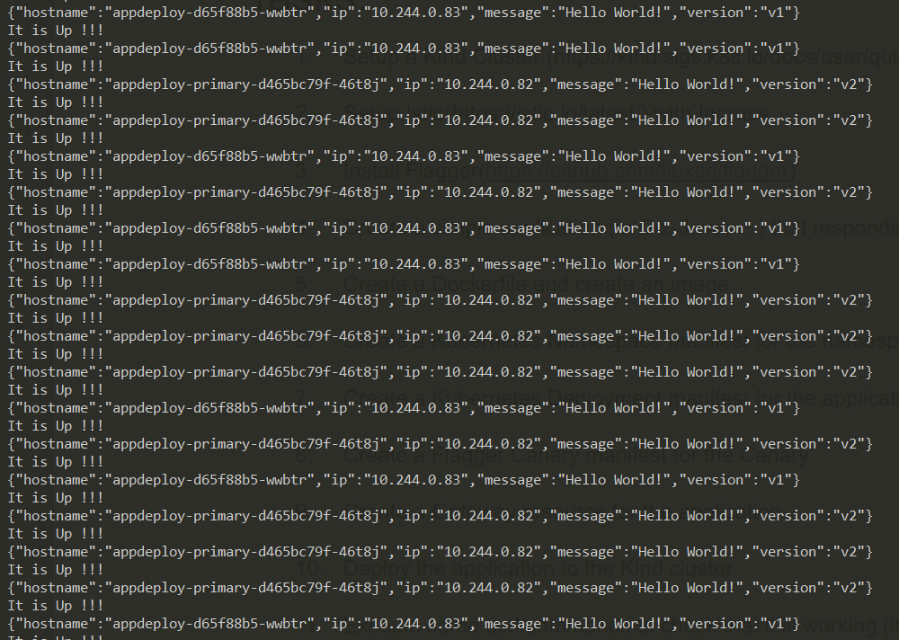

# Simple Canary Deployment using Istio and Flagger

> 1000 feet view for deployemnt 
1. Install Docker engine & ( Kind or Minikube ) locally to simulate k8s cluster and then kubectl.
2. Install Istio operator in k8s.
3. Install Flagger operator in k8s.
4. Create a small rest application using your favorite language.
5. Pack your application into docker image and test the application.
6. Create a k8s deployment and service files for the application.
7. Create a ingress gateway and virtual service for the application using istio.
8. Create a canary deployment file using flagger.
9. Apply the resources into k8s.
10. Test the end point whether it is working or not.
11. Update the image version in the deployment so that canary deplyment will trigger and updates the application according to the canary file.
12. watch the end point for some time you will see the rolling update.

> Step by Step with commands - 1
-  I am using ubuntu 20.4 LTS virtual machine instnace in GCP to perform these jobs.
-  sudo apt update
-  sudo apt upgrade
-  curl -Lo ./kind https://kind.sigs.k8s.io/dl/v0.11.1/kind-linux-amd64
-  chmod +x ./kind
-  mv ./kind ~/kind
- check kind is available or not in the path
-  export PATH="~/:$PATH"
- sudo apt-get remove docker docker-engine docker.io containerd runc (uninstall previous versions of docker)
- sudo apt-get install 
    ca-certificates &&
    curl &&
    gnupg &&
    lsb-release
- curl -fsSL https://download.docker.com/linux/ubuntu/gpg | sudo gpg --dearmor -o /usr/share/keyrings/docker-archive-keyring.gpg
- echo \
  "deb [arch=$(dpkg --print-architecture) signed-by=/usr/share/keyrings/docker-archive-keyring.gpg] https://download.docker.com/linux/ubuntu 
  $(lsb_release -cs) stable" | sudo tee /etc/apt/sources.list.d/docker.list > /dev/null
- sudo apt-get update
- sudo apt-get install docker-ce docker-ce-cli containerd.io
- sudo docker run hello-world (for testing purpose)
- now its time to add current user to docker group
- sudo groupadd docker
- sudo usermod -aG docker $USER
- exit (login again)
- newgrp docker
- docker run hello-world (now you can run docker with user permissions no need sudo)
- kind create cluster --name test
- curl -LO "https://dl.k8s.io/release/$(curl -L -s https://dl.k8s.io/release/stable.txt)/bin/linux/amd64/kubectl"
- sudo install -o root -g root -m 0755 kubectl /usr/local/bin/kubectl
- kubectl version --client (check installed or not)
- kubectl cluster-info --context kind-test
- Since I am using VM, The VM don't have a capacity to create a loadbalancer so I need to configure a external loadbalancer  (metallb for k8s)
- kubectl apply -f https://raw.githubusercontent.com/metallb/metallb/master/manifests/namespace.yaml
- kubectl create secret generic -n metallb-system memberlist --from-literal=secretkey="$(openssl rand -base64 128)" 
- kubectl apply -f https://raw.githubusercontent.com/metallb/metallb/master/manifests/metallb.yaml
- kubectl get pods -n metallb-system --watch
- docker network inspect -f '{{.IPAM.Config}}' kind
- Based on the above step we will ge the docker ip network range so we need add some subnet range in the configMap.
- you can see the ConfigMap in configuration folder.
- you need to apply ConfigMap resource in the cluster.
- If you want you can test by applying some deployment and expose the deployment using LoadBalancer
- Now the cluster is ready with pre configuration.

> Step by Step with commands - 2
- curl -L https://istio.io/downloadIstio | sh -
- cd istio-1.12.2 (could be some other verison)
- export PATH=$PWD/bin:$PATH
- istioctl install --set profile=demo -y
- kubectl label namespace default istio-injection=enabled
- kubectl apply -f https://raw.githubusercontent.com/istio/istio/release-1.10/samples/addons/prometheus.yaml
- check all the pods are running or not in istio-system namespace it should contain ingress, engress, istiod and prometheus !!

> Step by Step with commands - 3
- curl https://baltocdn.com/helm/signing.asc | sudo apt-key add -
- sudo apt-get install apt-transport-https --yes
- echo "deb https://baltocdn.com/helm/stable/debian/ all main" | sudo tee /etc/apt/- sources.list.d/helm-stable-debian.list
- sudo apt-get update
- sudo apt-get install helm
- helm repo add flagger https://flagger.app
- kubectl apply -f https://raw.githubusercontent.com/fluxcd/flagger/main/artifacts/flagger/crd.yaml
- helm upgrade -i flagger flagger/flagger --namespace=istio-system --set crd.create=false --set meshProvider=istio --set metricsServer=http://prometheus:9090
- helm upgrade -i flagger-grafana flagger/grafana --namespace=istio-system --set url=http://prometheus.istio-system:9090 --set user=admin --set password=change-me
- now check the pods again in istio-system namespace you will flagger and flagger-grafana pods to the existing pods.

> Step by Step with commands - 4 & 5
- I have created a spring boot based rest application which contians 2 end points 
- 1. / - gives json response with version and pod information
- 2. /status - give "it's up !!!" messgae
- install maven in the system and package the application using below commands
- mvn clean package
- you can see the jar file in the target folder
- Later you can use Dockerfile to package the jar into image. you can check the root folder of application to check Dockerfile
- If you use jib maven plugin from the google you don't need to create any Dockerfile simple if you run mvn jib:build command the image will be built automatically without Dockerfile
- later login to docker hub registry where we store the docker images
- docker login -u <username> -p 
- tag the existing docker images with appropriate versions and push them to hub
-  Basically after pushing the image make a changes in the code and push the image again with new version tag (since our main focus is for canary deployment It will be helpfull)
- Now at this point of time we are having 2 versions (0.0.1-SNAPSHOT,0.0.2-SNAPSHOT) let us say !!

> Step by Step with commands - 6 & 7
- Create a k8s deployment and service file and you can refer to my files from kubernetes folder.
- after deploying check the pods and services
- kubectl run -i -t nginx --rm=true --image=nginx -- bash
- enter inside the shell and ping the end point using service name as DNS (http://appdeploy:8080/status) make sure you are inside the nginx pod 
- then exit from the pod
- 
- Create public gateway for ingress (incomming requests) and Create a virtual service to talk to pod.
- you can refer in the istio folde for reference.
- try to ping the end point using LoadBalancer endpoint.
- You can see the result as it is (you will get V1 since the pods are running v1)
- 
- Here if we don't use flagger use can also do canary deployment using istio in those can you need to write deployment files for different versions and lable them with versions.
- later create a destinationRule object and add the destination rules for the pods.
- In the virtual service define how much % of trafffic needs to go to differnt versions.
- 
- I haven't written the example for that deployment but you can get many references from the internet.

> Step by Step with commands - 8,9,10,11 and 12
- 
- Now time for the flagger canary deployment before you do this step please delete the virtual service applied during istio deployment. 
- You can refer the canary deployment provided in the flagger folder to customize your canary deployment file.
- If you apply canary deployment It will crate a virtual service and maps to the gateway.
-
- After some time check the pods you can only see 1 pod that too with <pod-name>-primary will be running.
- Try to ping the end point using LoadBalancer you can see the traffice is flowing from GW and resoponds with v1 result.
- 
- Now its time for the magic ....
- You can change the deoloyment image to the next version 
- kubectl set image deployment/appdeploy appdeploy=katikireddy1997/hello-app:0.0.2-SNAPSHOT
- then if you enter 
- kubectl get canary
- you can see slowly the traffice is shiffting towards the new pods..
-
- Till the mentioned % of pods are reached the trffic will be spllited.
- If you pind the Loadbalancer end point now you can see both the versions are apperaing as response. I will enclose this in the screen shot below.
-

-
-
- Now the Canary Deployment Is Sucessfull !!!!